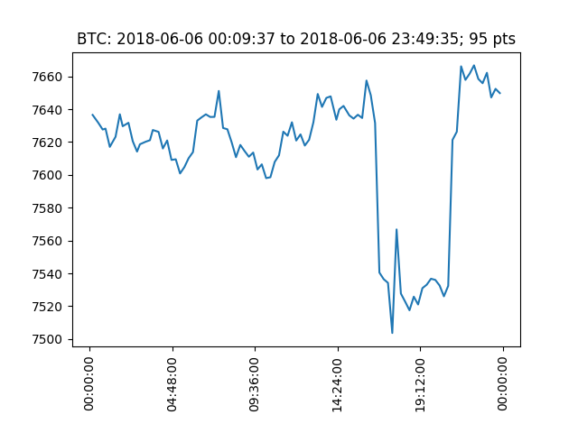
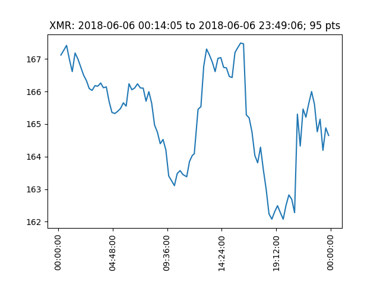
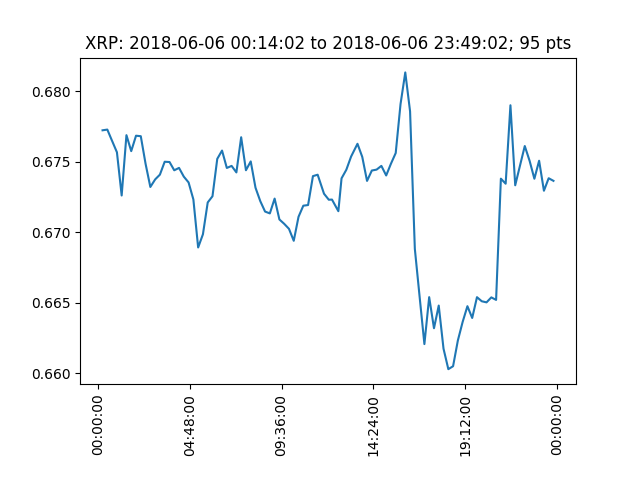
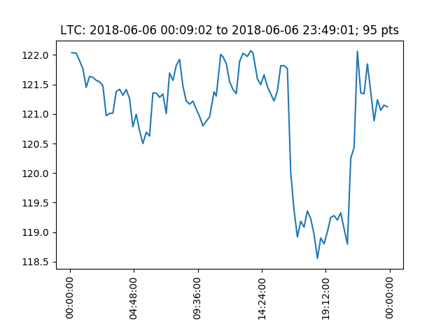
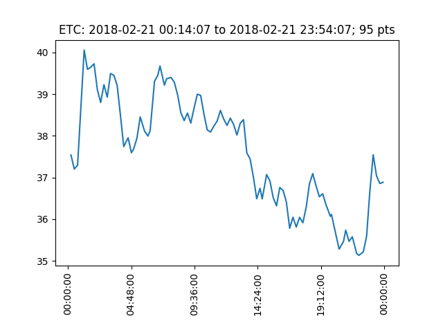
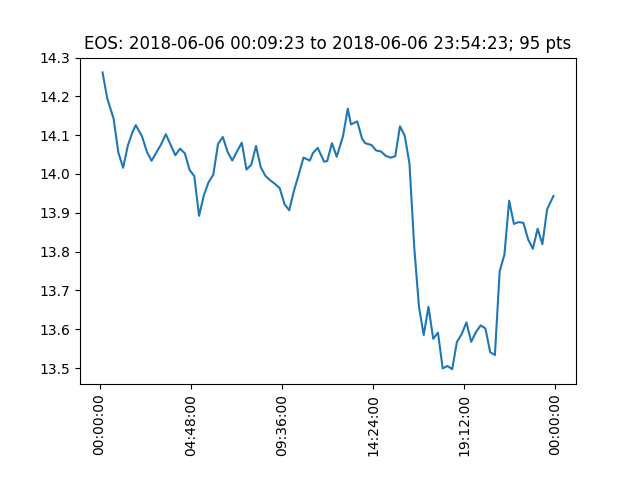
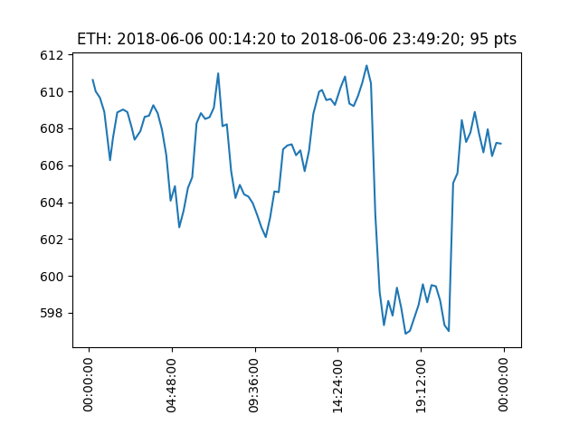
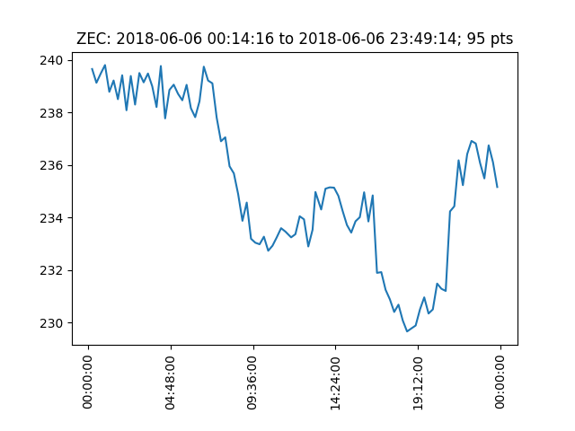
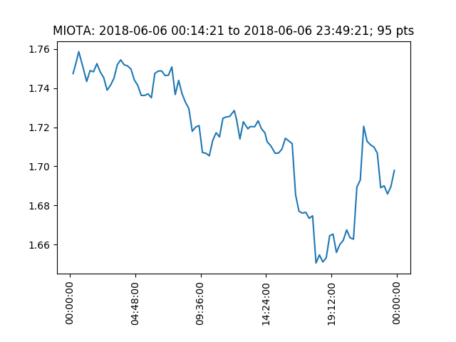

Crypto15
========

Dataset of snapshots captured every 15 minutes of the status of 9 cryptocurrencies.

## Version 1

**Begin snapshots**: 2017-10-26 14:34:10
**End snapshots**: 2019-02-25 09:50:02
**Average snapshots per day**: 95

| Symbol | days |
| --- | --- |
| BTC | 357 |
| XMR | 357 |
| XRP | 357 |
| LTC | 357 |
| ETH | 357 |
| ETC |269 |
| EOS | 357 |
| MIOTA | 357 |
| ZEC | 357 |

### Features

Every snapshot contains the following features:

| Feature | Description |
| --- | --- |
| currency | The currency symbol |
| time | The date and time, in UTC format, when the snapshot has been captured |
| price_btc | The price in BTC of the currency |
| price_usd | The price in USD of the currency |
| day_volume_usd | The volume exchanged in the previous 24h |
| market_cap_usd | The market capitalization |
| percent_change_1h | The rate of change of the value in the previous hour |
| percent_change_24h | The rate of change of the value in the previous 24 hours |
| percent_change_7d | The rate of change of the value in the previous 7 days |

The data is not perfectly clean: there could be data points sampled not exactly every 15 minutes, missing days, ...

If you're wiling to contribute to this project, a data analysis that highlights all the dirty parts of the dataset it is welcome!

## Usage

### Loading data with sqilte3

Data comes stored in a sqlite3 database whose schema is:

```sql
monitored_currencies(
        currency text,
        time datetime,
        price_btc double,
        price_usd double,
        day_volume_usd big int,
        market_cap_usd big int,
        percent_change_1h real,
        percent_change_24h real,
        percent_change_7d real);
```

Each row is a **single snapshot**. The database location is `data/crypto15.db3`.

To use is you can just use any sqlite3 library in any language, or the sqlite3 cli tool.

### Loading data with Tensorflow

The file `crypto15.py` follows the Tensorflow Dataset (tfds) format. The following example shows how to use it with Tensorflow 2.0.

You can just import this file in your Tensorflow project and it automatically downloads, converts to TFRecords and creates the splits for each currency.

```python
import tensorflow_datasets as tfds
import crypto15  # pylint:disable=unused-import

datasets, info = tfds.load("crypto15", with_info=True)
print(info)
for currency in info.splits.keys():
    dataset = datasets[currency]
    # Use this split as you wish.
```

The dataset `info` variable contains all the information required to use it:

```python
tfds.core.DatasetInfo(
    name='crypto15',
    version=1.0.0,
    description='
        Crypto15: snapshot captured every 15 minutes of the status of 9 cryptocurrencies.
            Version 1: data from 2017-10-26 14:34:10 to 2019-02-25 09:50:02.
            Currencies: "BTC", "XRP", "ETH", "LTC", "XMR", "MIOTA", "ZEC", "EOS", "ETC"
        ',
    urls=['https://github.com/galeone/crypto15/blob/master/data/crypto15.db3?raw=true'],
    features=SequenceDict({
        'day_volume_usd': Tensor(shape=(), dtype=tf.int64),
        'market_cap_usd': Tensor(shape=(), dtype=tf.int64),
        'percent_change_1h': Tensor(shape=(), dtype=tf.float64),
        'percent_change_24h': Tensor(shape=(), dtype=tf.float64),
        'percent_change_7d': Tensor(shape=(), dtype=tf.float64),
        'price_btc': Tensor(shape=(), dtype=tf.float64),
        'price_usd': Tensor(shape=(), dtype=tf.float64),
        'timestamp': Tensor(shape=(), dtype=tf.int64)
    },
    total_num_examples=3125,
    splits={
        'BTC': <tfds.core.SplitInfo num_examples=357>,
        'EOS': <tfds.core.SplitInfo num_examples=357>,
        'ETC': <tfds.core.SplitInfo num_examples=269>,
        'ETH': <tfds.core.SplitInfo num_examples=357>,
        'LTC': <tfds.core.SplitInfo num_examples=357>,
        'MIOTA': <tfds.core.SplitInfo num_examples=357>,
        'XMR': <tfds.core.SplitInfo num_examples=357>,
        'XRP': <tfds.core.SplitInfo num_examples=357>,
        'ZEC': <tfds.core.SplitInfo num_examples=357>
    },
```

**Warning**: the data in the split **does not follow the temporal order**.
`tfds` when creates the TFRecords automatically shuffles the data. This means that a single `tf.Example` is ordered (the snapshots in a day are sequential) but two elements extracted from the split are unlikely to be sequential.

## Data collection and sources

The data has been collected during the years using a Raspberry PI (here's the [setup](https://pgaleone.eu/raspberry/ethereum/archlinux/2017/09/06/ethereum-node-raspberri-pi-3/)).

- [OpenAT Daemon: crypto currency monitor and algorithmic trading bot](https://github.com/galeone/openatd) is the daemon that collects the data (and trades)
- [OpenAT: Open Source Algorithmic Trading Library](https://github.com/galeone/openat) is the C++ library on which OpenAT Daemon is based.

The data is collected from the API of:

- [CoinMarketCap](http://coinmarketcap.com): before the discontinuing of their public API.
- [alternative.me](https://alternative.me/crypto/api/)

## Examples

The following charts are created by using the `plot-first.py` script, that uses the dataset in its tfds format, therefore the sampled day is random.

The charts shows only how the price in USD changes during a day, using the 95 snapshots available for that day:

### BTC



### XMR



### XRP



### LTC



### ETC



### EOS



### ETH



### ZEC



### MIOTA



## Disclaimer

### No Investment Advice

The information provided on this website does not constitute investment advice, financial advice, trading advice, or any other sort of advice and you should not treat any of the website's content as such. Do conduct your own due diligence and consult your financial advisor before making any investment decisions.
